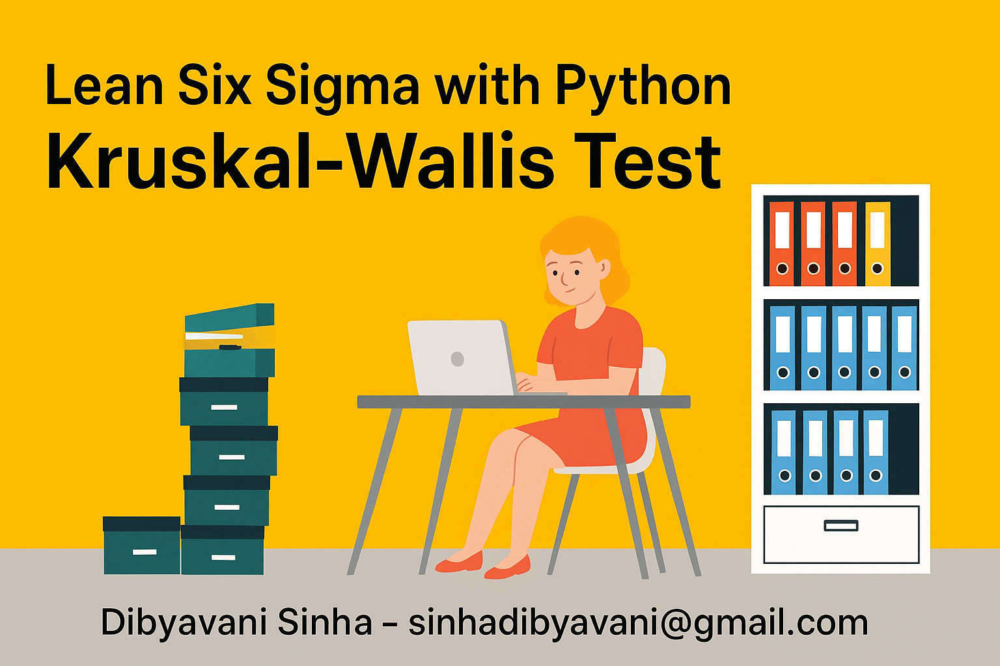

# Lean Six Sigma with Python — Kruskal Wallis Test 👷

*Using Python to perform the Kruskal–Wallis Test evaluating the impact of training on warehouse operators’ productivity*

  

---

## Overview
Lean Six Sigma (LSS) is a method based on a stepwise approach to process improvements.  
This project demonstrates how Python can be used to perform hypothesis testing (Kruskal–Wallis) to analyze process improvement.

---

## Scenario
Imagine you are the Continuous Improvement Manager of a Distribution Center (DC) for a luxury brand.  
The warehouse receives garments that require final assembling and value-added service (VAS) during the inbound process.

### Objective
With the support of the R&D team, you designed training for VAS operators to improve their productivity and reduce quality issues.

### Question
Does the training have a positive impact on the productivity of operators?

### Hypothesis
The training has a positive impact on the productivity of VAS operators.

### Experiment
Randomly select operators and measure the time per batch (time to finish a batch of 30 labels in seconds) to build a sample of 56 records.

---

## Dataset
This repository includes:
- **df_sewing.xlsx** → dataset used in the analysis  
- **Kruskal Wallis Test.ipynb** → Jupyter Notebook containing Python implementation  
- **thumbnail.png** → project thumbnail  

---

## Code
All the Python code used to perform the Kruskal–Wallis Test and analyze training impact is available in the notebook.

---

## About Me 🤓
**Author:** Dibyavani Sinha  
**Email:** sinhadibyavani@gmail.com  
**GitHub:** [sinhadibyavani-commits](https://github.com/sinhadibyavani-commits)
